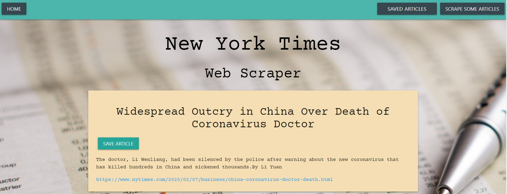
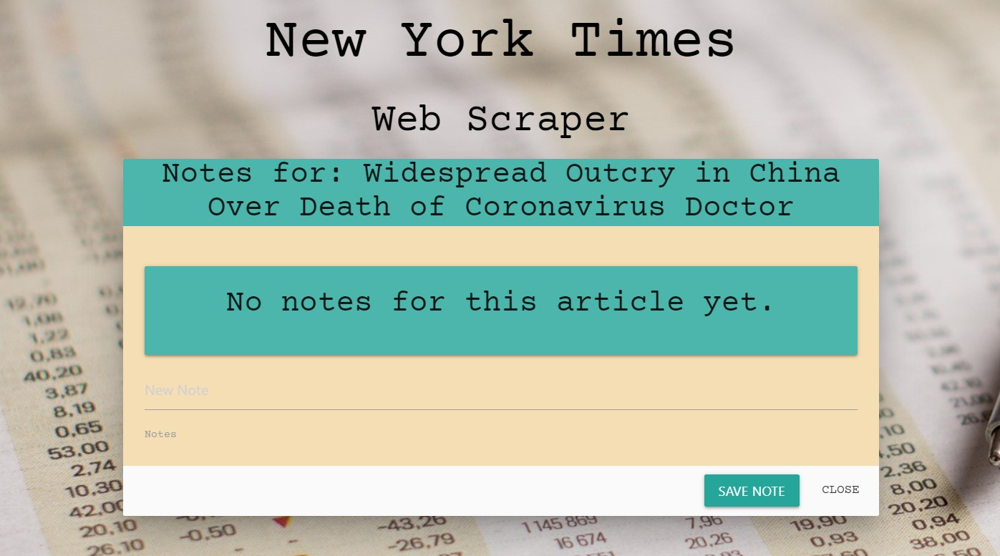
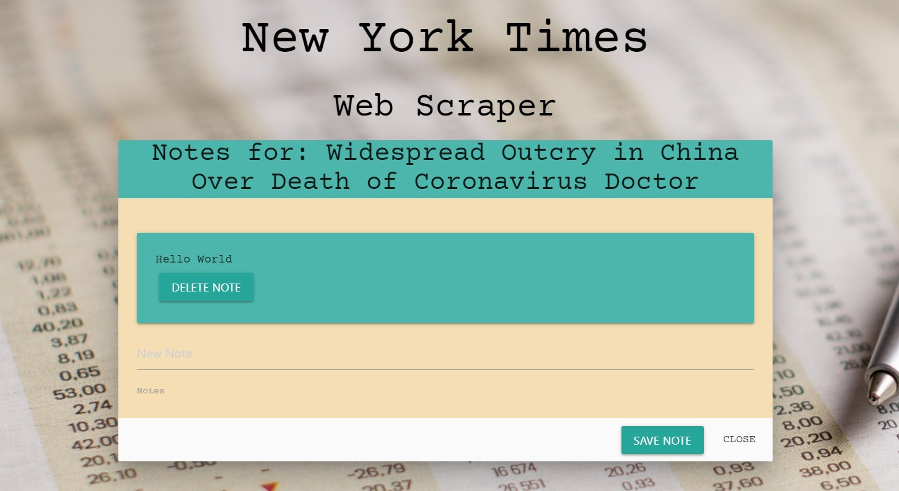

# scraped

# New York Times WebScraper

#### Overview

An app that scrapes the technology section of the New York Times. 

#### Link to the application

https://evening-thicket-08549.herokuapp.com/

#### How it works

* Scrape articles by hitting the scrape articles button.
* To view the articles you have scraped, hit the home button.
* Save an article by clicking on the save article button.
* After saving an article, click on the saved articles page.
* On the saved articles page you can either add a note to an article or delete the article from the saved articles.

#### Adding a Note

#### Technologies Used

* Node.js
* Express.js
* Handlesbars.js
* MongoDB
* Mongoose
* Materialize
* HTML5
* CSS3
* Javascript
* JQuery